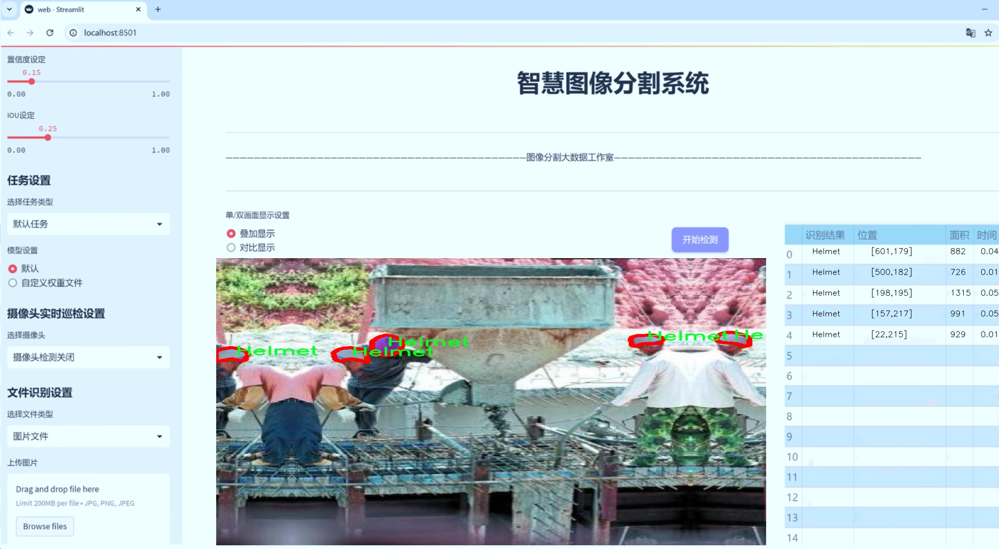
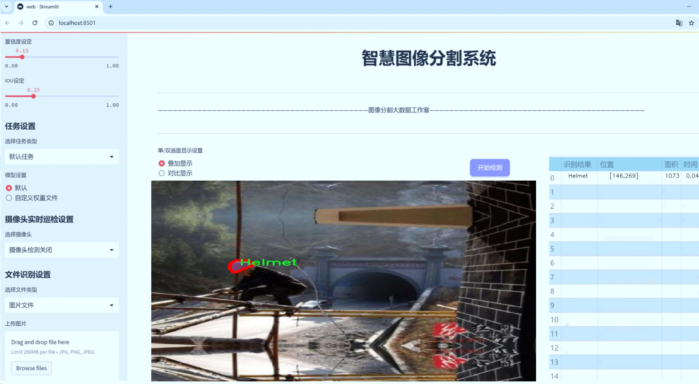
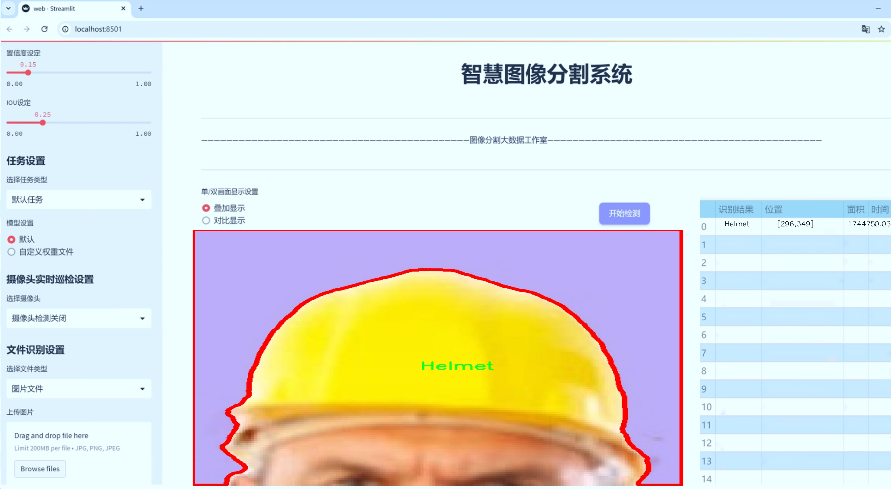
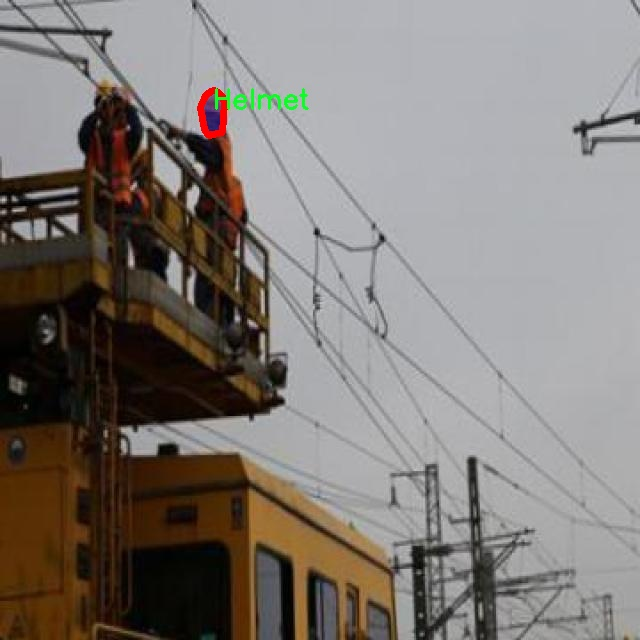
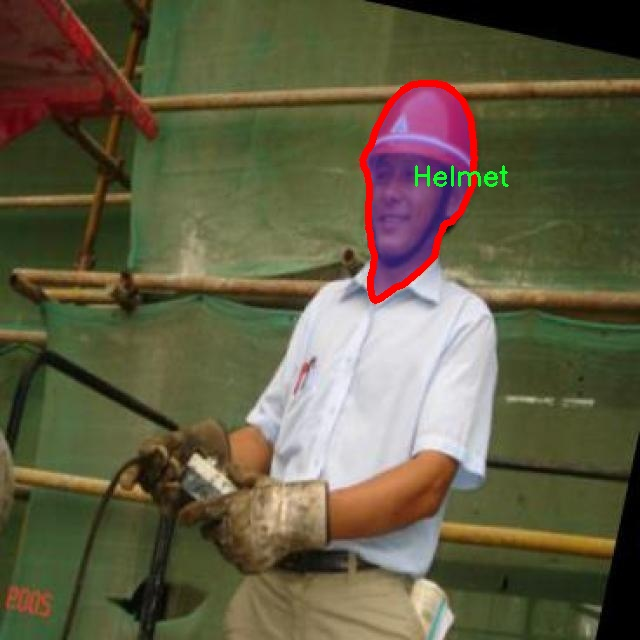
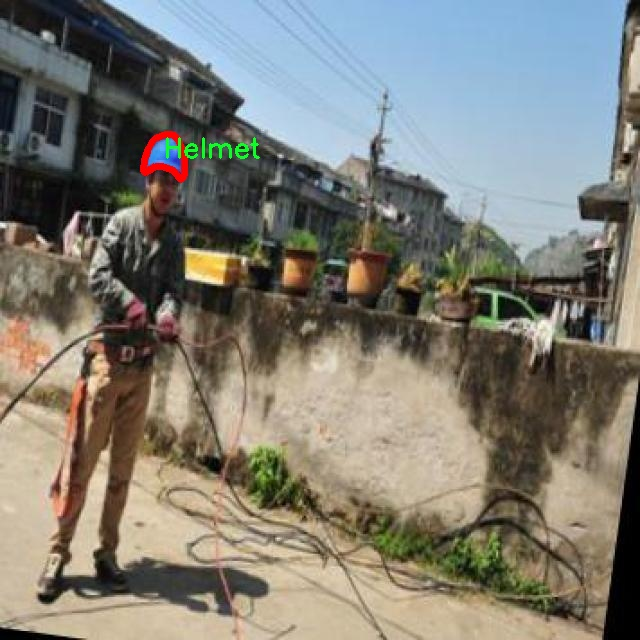
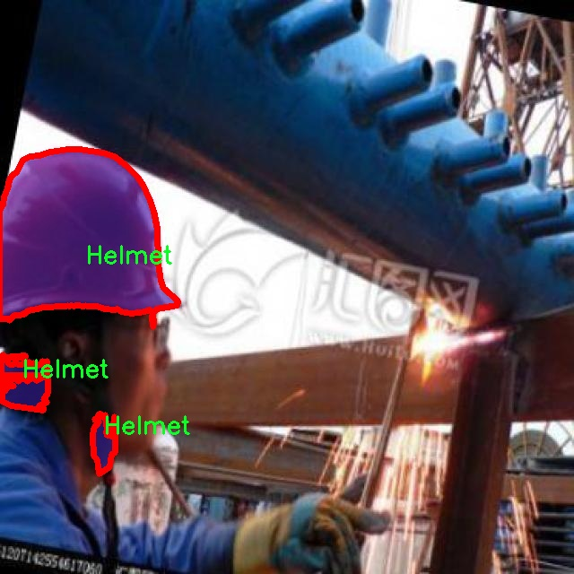
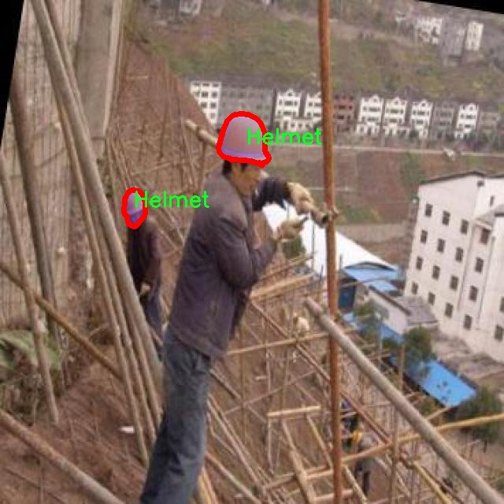

# 个人防护装备图像分割系统源码＆数据集分享
 [yolov8-seg-C2f-DySnakeConv＆yolov8-seg-repvit等50+全套改进创新点发刊_一键训练教程_Web前端展示]

### 1.研究背景与意义

项目参考[ILSVRC ImageNet Large Scale Visual Recognition Challenge](https://gitee.com/YOLOv8_YOLOv11_Segmentation_Studio/projects)

项目来源[AAAI Global Al lnnovation Contest](https://kdocs.cn/l/cszuIiCKVNis)

研究背景与意义

随着工业化进程的加快和城市化水平的提高，个人防护装备（PPE）在保障工人安全和健康方面的重要性愈发凸显。PPE的有效使用能够显著降低工作场所的事故发生率，保护工人免受各种潜在危险的侵害。因此，如何高效、准确地识别和分割个人防护装备图像，成为了计算机视觉领域亟待解决的关键问题之一。近年来，深度学习技术的迅猛发展为图像分割任务提供了新的解决方案，其中YOLO（You Only Look Once）系列模型因其高效性和实时性而备受关注。特别是YOLOv8的推出，进一步提升了目标检测和分割的精度与速度，为PPE图像的处理提供了新的机遇。

本研究旨在基于改进的YOLOv8模型，构建一个高效的个人防护装备图像分割系统。为此，我们将使用一个包含3500张图像的数据集，该数据集涵盖了六类个人防护装备，包括靴子、手套、护目镜、头盔、工作服和人。这些类别的多样性不仅丰富了数据集的内容，也为模型的训练和测试提供了充分的样本，确保了系统的泛化能力和适用性。通过对这些图像进行实例分割，我们能够精确地识别出每个防护装备的轮廓及其在图像中的位置，从而为后续的安全监测和评估提供可靠的数据支持。

在实际应用中，PPE的图像分割系统可以广泛应用于多个领域，包括工业安全监测、智能安防、自动化生产线等。通过实时监测工人是否佩戴合适的防护装备，企业能够及时发现安全隐患，降低事故风险，提高工作场所的安全性。此外，该系统还可以为工人提供佩戴指导，确保他们在工作中始终保持最佳的防护状态，从而进一步提升整体工作效率和安全保障。

然而，现有的图像分割技术在处理复杂场景、遮挡物体以及不同光照条件下的图像时，仍然面临诸多挑战。因此，本研究将通过对YOLOv8模型的改进，探索其在PPE图像分割中的应用潜力。我们将重点关注模型的网络结构优化、数据增强技术的应用以及训练策略的改进，以提高模型在多样化场景下的表现。通过这些研究，我们期望能够提升图像分割的精度和效率，为个人防护装备的智能识别和管理提供更为坚实的技术基础。

综上所述，基于改进YOLOv8的个人防护装备图像分割系统的研究，不仅具有重要的理论意义，也具备广泛的实际应用价值。通过本研究，我们希望能够推动PPE领域的智能化发展，为保障工人安全、提升工作效率贡献一份力量。

### 2.图片演示







##### 注意：由于此博客编辑较早，上面“2.图片演示”和“3.视频演示”展示的系统图片或者视频可能为老版本，新版本在老版本的基础上升级如下：（实际效果以升级的新版本为准）

  （1）适配了YOLOV8的“目标检测”模型和“实例分割”模型，通过加载相应的权重（.pt）文件即可自适应加载模型。

  （2）支持“图片识别”、“视频识别”、“摄像头实时识别”三种识别模式。

  （3）支持“图片识别”、“视频识别”、“摄像头实时识别”三种识别结果保存导出，解决手动导出（容易卡顿出现爆内存）存在的问题，识别完自动保存结果并导出到tempDir中。

  （4）支持Web前端系统中的标题、背景图等自定义修改，后面提供修改教程。

  另外本项目提供训练的数据集和训练教程,暂不提供权重文件（best.pt）,需要您按照教程进行训练后实现图片演示和Web前端界面演示的效果。

### 3.视频演示

[3.1 视频演示](https://www.bilibili.com/video/BV1tX24YLEu5/)

### 4.数据集信息展示

##### 4.1 本项目数据集详细数据（类别数＆类别名）

nc: 6
names: ['Boots', 'Gloves', 'Goggles', 'Helmet', 'Person', 'Vest']


##### 4.2 本项目数据集信息介绍

数据集信息展示

在本研究中，我们使用了名为“PPE vest helmet”的数据集，以训练和改进YOLOv8-seg模型，旨在实现高效的个人防护装备（PPE）图像分割系统。该数据集专注于六种关键的个人防护装备类别，具体包括：Boots（靴子）、Gloves（手套）、Goggles（护目镜）、Helmet（头盔）、Person（人）和Vest（背心）。这些类别的选择不仅反映了在工业和建筑等高风险环境中，个人防护装备的重要性，也为模型的训练提供了丰富的样本数据。

“PPE vest helmet”数据集的构建，旨在为深度学习模型提供多样化的图像样本，以便在实际应用中能够有效识别和分割不同类型的个人防护装备。数据集中包含的图像涵盖了各种环境和场景，确保了模型在不同条件下的鲁棒性。例如，靴子和手套的图像可能来源于工地、实验室或医疗环境，而护目镜和头盔则可能在建筑工地或工业生产线上被广泛使用。这样的多样性使得模型能够学习到装备在不同背景下的特征，从而提高分割精度。

在数据集的构成上，六个类别的样本数量经过精心设计，以确保每个类别都有足够的训练数据。Boots和Gloves作为基础的个人防护装备，通常在各类工作场所中都能见到，因此在数据集中占据了较大的比例。相对而言，Goggles和Helmet则可能在特定的行业中更为常见，如建筑和制造业，这使得这些类别的样本相对较少，但依然具备代表性。Person类别的引入则是为了帮助模型理解装备与人的关系，确保在实际应用中能够准确识别佩戴装备的人员。

数据集的图像质量和标注准确性也是其成功的关键因素。每张图像都经过专业的标注，确保了每个类别的边界框和分割区域的准确性。这种高质量的标注不仅提升了模型的训练效果，也为后续的评估和测试提供了可靠的基准。此外，数据集还考虑到了不同光照条件、角度和背景的变化，使得模型在面对真实世界的复杂情况时，能够保持良好的性能。

通过对“PPE vest helmet”数据集的深入分析和应用，我们期望能够显著提升YOLOv8-seg模型在个人防护装备图像分割任务中的表现。该数据集不仅为模型的训练提供了丰富的样本，还为后续的研究和应用奠定了坚实的基础。随着个人防护装备在各行各业中的重要性日益凸显，基于该数据集开发的图像分割系统将为提升工作场所的安全性和效率提供强有力的支持。











### 5.全套项目环境部署视频教程（零基础手把手教学）

[5.1 环境部署教程链接（零基础手把手教学）](https://www.bilibili.com/video/BV1jG4Ve4E9t/?vd_source=bc9aec86d164b67a7004b996143742dc)


[5.2 安装Python虚拟环境创建和依赖库安装视频教程链接（零基础手把手教学）](https://www.bilibili.com/video/BV1nA4VeYEze/?vd_source=bc9aec86d164b67a7004b996143742dc)

### 6.手把手YOLOV8-seg训练视频教程（零基础小白有手就能学会）

[6.1 手把手YOLOV8-seg训练视频教程（零基础小白有手就能学会）](https://www.bilibili.com/video/BV1cA4VeYETe/?vd_source=bc9aec86d164b67a7004b996143742dc)


按照上面的训练视频教程链接加载项目提供的数据集，运行train.py即可开始训练



     Epoch   gpu_mem       box       obj       cls    labels  img_size
     1/200     0G   0.01576   0.01955  0.007536        22      1280: 100%|██████████| 849/849 [14:42<00:00,  1.04s/it]
               Class     Images     Labels          P          R     mAP@.5 mAP@.5:.95: 100%|██████████| 213/213 [01:14<00:00,  2.87it/s]
                 all       3395      17314      0.994      0.957      0.0957      0.0843

     Epoch   gpu_mem       box       obj       cls    labels  img_size
     2/200     0G   0.01578   0.01923  0.007006        22      1280: 100%|██████████| 849/849 [14:44<00:00,  1.04s/it]
               Class     Images     Labels          P          R     mAP@.5 mAP@.5:.95: 100%|██████████| 213/213 [01:12<00:00,  2.95it/s]
                 all       3395      17314      0.996      0.956      0.0957      0.0845

     Epoch   gpu_mem       box       obj       cls    labels  img_size
     3/200     0G   0.01561    0.0191  0.006895        27      1280: 100%|██████████| 849/849 [10:56<00:00,  1.29it/s]
               Class     Images     Labels          P          R     mAP@.5 mAP@.5:.95: 100%|███████   | 187/213 [00:52<00:00,  4.04it/s]
                 all       3395      17314      0.996      0.957      0.0957      0.0845


### 7.50+种全套YOLOV8-seg创新点代码加载调参视频教程（一键加载写好的改进模型的配置文件）

[7.1 50+种全套YOLOV8-seg创新点代码加载调参视频教程（一键加载写好的改进模型的配置文件）](https://www.bilibili.com/video/BV1Hw4VePEXv/?vd_source=bc9aec86d164b67a7004b996143742dc)

### 8.YOLOV8-seg图像分割算法原理

原始YOLOv8-seg算法原理

YOLOv8-seg算法是YOLO系列中一个重要的进展，专注于目标检测与分割任务的结合。作为一种高效的目标检测算法，YOLOv8在设计上不仅继承了YOLO系列的优良传统，还进行了多项创新，尤其是在特征提取和损失计算方面。该算法的核心思想是通过引入先进的网络结构和优化策略，以实现更高的检测精度和更快的处理速度。

首先，YOLOv8-seg算法的骨干网络依然采用了跨级结构（Cross Stage Partial, CSP）的设计理念，这一设计旨在通过分离特征通道来提高网络的表达能力和计算效率。在此基础上，YOLOv8对YOLOv5中的C3模块进行了优化，替换为更加轻量化的C2f模块。C2f模块不仅减少了计算复杂度，还通过增加残差连接来增强梯度信息的流动，从而提升了模型的训练效果。这种结构的设计使得YOLOv8在特征提取过程中能够更好地捕捉到细粒度的上下文信息，尤其是在复杂场景下的目标检测任务中。

在特征融合方面，YOLOv8-seg算法采用了特征金字塔网络（FPN）结构，通过下采样和上采样的方式实现多尺度特征的融合。这一过程确保了网络能够在不同尺度上对目标进行有效的检测与分割。值得注意的是，YOLOv8在上采样阶段删除了传统的卷积结构，这一创新使得特征融合过程更加高效，减少了计算资源的消耗。此外，YOLOv8还引入了空间金字塔池化（SPP）模块，以进一步增强模型对多尺度目标的感知能力。

YOLOv8-seg算法的另一个重要创新在于其损失计算策略。与传统的目标检测算法不同，YOLOv8采用了变焦损失（Zoom Loss）来计算分类损失，这一策略能够有效提高模型对小目标的检测能力。同时，YOLOv8还引入了数据平均保真度损失和完美交并比损失（Perfect IoU Loss）来计算边界框损失。这些新的损失函数设计使得YOLOv8在目标定位和分类任务中表现得更加精准，尤其是在复杂背景下的小目标检测中，显著减少了误检和漏检的情况。

为了适应不同场景的需求，YOLOv8提供了多种规模的模型选择，包括n、s、m、l、x五种不同的模型。这些模型在深度、特征图宽度和通道数上进行了优化，以确保在不同的应用场景中都能达到最佳的性能。尤其是在YOLOv8n模型中，采用了最小的尺度和深度设置，适合于资源受限的环境下进行实时目标检测与分割。

在数据处理方面，YOLOv8-seg算法通过多种数据增强技术提升了模型的鲁棒性。输入端的预处理包括马赛克数据增强、自适应图片缩放和灰度填充等，这些方法有效地增加了训练样本的多样性，使得模型在面对不同背景和光照条件时能够保持较高的检测精度。

此外，YOLOv8-seg算法在输出端采用了解耦合头结构，将分类和回归过程分离。这一设计使得模型在进行目标检测时，能够更灵活地处理正负样本的匹配与损失计算，进一步提升了模型的性能。通过Task-Aligned Assigner方法，YOLOv8能够对分类分数和回归分数进行加权匹配，从而优化样本的选择，提高训练效率。

总的来说，YOLOv8-seg算法在目标检测与分割领域的创新设计，充分体现了其在处理复杂场景下的高效性与准确性。通过优化网络结构、改进损失计算策略以及引入多样化的数据增强手段，YOLOv8-seg不仅提高了模型的检测精度，也在计算效率上做出了显著的提升。这些改进使得YOLOv8-seg成为当前目标检测与分割任务中一种极具竞争力的算法选择，适用于各种实际应用场景，如智能监控、自动驾驶和医疗影像分析等。随着YOLOv8-seg算法的不断发展与完善，未来在更广泛的领域中应用其潜力将愈加显著。


### 9.系统功能展示（检测对象为举例，实际内容以本项目数据集为准）

图9.1.系统支持检测结果表格显示

  图9.2.系统支持置信度和IOU阈值手动调节

  图9.3.系统支持自定义加载权重文件best.pt(需要你通过步骤5中训练获得)

  图9.4.系统支持摄像头实时识别

  图9.5.系统支持图片识别

  图9.6.系统支持视频识别

  图9.7.系统支持识别结果文件自动保存

  图9.8.系统支持Excel导出检测结果数据


### 10.50+种全套YOLOV8-seg创新点原理讲解（非科班也可以轻松写刊发刊，V11版本正在科研待更新）

#### 10.1 由于篇幅限制，每个创新点的具体原理讲解就不一一展开，具体见下列网址中的创新点对应子项目的技术原理博客网址【Blog】：


[10.1 50+种全套YOLOV8-seg创新点原理讲解链接](https://gitee.com/qunmasj/good)

#### 10.2 部分改进模块原理讲解(完整的改进原理见上图和技术博客链接)【此小节的图要是加载失败请移步原始博客查看，链接：https://blog.csdn.net/cheng2333333?type=blog】
### YOLOv8简介
在各种目标检测算法中，YOLO系列因其速度和准确度间的优异平衡脱颖而出，能够准确、快速的识别目标，便于部署到各种移动设备中，已经广泛应用于各种领域的目标检测、跟踪和分割。目前最新版本 YOLOv8由原v5的开发团队Ultralytics于2023年1月提出，按规格大小可划分为n、s、m、1和x5个版本，是目前最先进的目标检测算法，有着优异的性能，很适合用于无人机航拍图像目标检测。其网络结构如图所示。

YOLOv8模型包括Input、Backbone、Neck 和Head4部分。其中 Input选用了Mosaic数据增强方法，并且对于不同大小的模型，有部分超参数会进行修改，典型的如大模型会开启 MixUp 和CopyPaste数据增强，能够丰富数据集，提升模型的泛化能力和鲁棒性。Backbone主要用于提取图片中的信息，提供给Neck和Head使用，由多个Conv、C2f模块和尾部的SPPF组成。Conv模块由单个Conv2d、
BatchNorm2d和激活函数构成,用丁是双行在万E5特征图;YOLOv8参考了C3模块的残左绒以心YOLOv7[16l的ELAN思想，设计出了C2f 结构，可以在保证轻量化的同时获得更加丰富的梯度流信息，并根据模型尺度来调整通道数，大幅提升了模型性能;SPPF是空间金字塔池化，能够融合不同尺度的特征。Neck部分主要起特征融合的作用，充分利用了骨干网络提取的特征，采用FPN[17]+PAN[18〕结构，
能够增强多个尺度上的语义表达和定位能力。Head输出端根据前两部分处理得到的特征来获取检测目标的类别和位置信息，做出识别,换以小旦公来和定解耦头结构,将分类和检测头分:9w‘无锅框的位关注侧重点不同的问题，同时也采用了无锚框的目标检测（Anchor-Free)，能够提升检测速度。Loss计算方面采用了正负样本动态分配策略，使用 VFLLoss 作为分类损失，使用DFLLoss+CIOU Loss作为回归损失。

### AutoFocus: Efficient Multi-Scale Conv简介

参考该博客提出了AutoFocus，一种高效的多尺度目标检测算法。相较于以前对整个图像金字塔进行处理，该方法以一种由表及里的姿态，仅处理哪些整体上看来很有可能存在小物体的区域。这个可以通过预测一张类别未知的分割图FocusPixels来得到。为了高效利用FocusPixels，另外一个算法用于产生包含FocusPixels的FocusChips，这样可以减少计算量并处理更更精细的尺度。在不同尺度上FocusChips所得到的检测结果综合时，会出现问题，我们也提供了解决问题的方案。AutoFocus在COCO上的结果有49.7%mAP（50%重叠下68.3%），与多尺度baseline相仿但是快了2.5倍。金字塔中处理的像素数量减少了5倍mAP只下降1%，在与RetinaNet采用相同的ResNet-101结构且速度相同时，高了10%mAP。

人类寻找物体是一个动态的过程，且寻找时间与场景的复杂度是直接相关的。当我们的眼神在不同的点之间漂移时，其他的区域会被我们有意忽视。然而，现在的检测算法是一种静态的推理过程且图像金字塔中的每个像素都受到了一样的对待，这使得过程变得没有效率。现在许多的应用都不强调实时性，而计算上的节省其实可以产生很大收益。

在COCO数据集中，虽然40%的物体都是小物体，但是它们一共只占了全图的0.3%。如果金字塔是3倍关系，则在高分辨率层要进行9倍的运算。XXX 。那么有没有办法在低分辨率下找出可能含有这些物体的区域呢？

以人眼方案类比，我们可以从低分辨率图像开始，找出有可能存在物体的区域再“聚集”到高分辨率。我们的AutoFocus会在一层中计算小物体的分割图FocusPixels，而在每一个FocusPixels上会用一个算法产生下一层所需要关注的chips。在COCO的最大分辨率层上我们可以只处理**20%的像素而性能不下降，如果只处理5%**也只下降1%而已。


图像金字塔与卷积神经网络对CV十分重要。然而卷积神经网络无法做到对尺度不敏感，所以为了不同大小的物体需要依赖图像金字塔。虽然训练已经有了高效的方法，但是其推断时间依然远离实际使用标准。

目标检测加速有很长历史了。常用的有特征近似以减少尺度、级联、特征金字塔，且最后一个最近很多人研究。

AutoFocus为速度与精度之间提供了一个平滑的折衷，指出可以在低分辨率下看出小物体的所在，从而节约计算。FocusPixels的计算较为容易。

先简单介绍一下SNIP，是一种多尺度的训练、推断算法。主要思想是训练针对某个特定scale的检测器而不是scale-invariant检测器。这样训练样本就局限于在某个尺度范围内，以适于这个检测器处理。比如在高分辨率仅处理小物体而高分辨率仅处理大物体，其优势在于训练时不用考虑尺度的变化。

由于训练时物体大小是已知的，我们在图像金字塔中可以忽略大量区域而只处理物体周围的区域。SNIPER说明这样低分辨率的训练与全图训练相比并不会降低性能。同样，在推断过程中如果可以在大分辨率图像上预测可能出现小物体的chip，我们也就不用处理整张高分辨率图片。在训练时，许多物体会被裁剪、扭曲，这可以当作是一种数据扩增，然而当这个情况在推断时出现，则会产生错误，所以我们还需要一个算法来整合不同尺度上的检测结果。

#### AutoFocus框架
如SIFT、SURF等传统分类特征包含两个组件，一个detector和一个descriptor。detector只包含轻量级的操作如DoG、LoG，用于在整张图片上找到感兴趣的区域；descriptor，一般来说计算量比较大，则只需要关注那些咸兴趣的区域。这个级联结构保障了图片处理的效率。

同样，AutoFocus框架也是用于预测感兴趣的区域，并丢弃在下一尺度不可能存在物体的区域，并将裁剪和缩放后的区域传递给下一尺度。AutoFocus由三个部分组成：FocusPixels，FocusChips和focus stacking。

#### FocusPixels
FocusPixels定义在卷积网络特征图的粒度之上（如conv5），如果特征图上某个像素与小物体有重叠则标注为一个FocusPixel。（小物体：面积处于一个网络的输入范围之内）。训练过程中，FocusPixels标注为正，某些与不在面积范围内的物体有重叠的像素标注为无效，其他像素标注为负。AutoFocus的训练目标是使在FocusPixels区域产生较大的激活值。

如果同时多个物体与同一像素重叠，优先给正标注。我们的网络输入是512x512，然后a,b,c取值分别是5,64,90。对于太大或太小的物体，我们认为当前尺度上没有足够人信息进行判断，所以会标定为无效。整个网络结构如下图。训练时加两层带ReLU的卷积(3x3和1x1)以及一个二分类softmax来预测FocusPixels。


#### FocusChip生成
推断过程中，我们标注输出概率大于阈值t的像素（这个参数可以控制加速比），得到一些连通域。对于每一个域，我们做一次膨胀使其包含一些有助于识别的周围信息，膨胀后相连的部分要合并。然后，我们生成一些包含连通域的chips（不同chips可能重叠，如有重叠则合并）。有些chip可能太小缺少必要信息，并使chip的大小变化很大，为了效率我们要求保证一个最小的chip size。算法流程如下：


#### 级联推断过程
我们的过程类似于图片金字塔的推断过程但是在过程中一步步去除不关注的图片区域。我们在最低分辨率上进行检测并生成chips，然后在这些chips再进行检测和生成chips。

#### Focus Stacking
这种级联分类器的一个问题是在chip边缘本来的大物体可能生成一些被剪裁的检测目标。在下一个尺度上，由于剪裁过了，所以会检测到小的、错误的正例False Positive。之前算法中的第二步膨胀其实就是为了保证没有物体会出现在chip的边缘。这样，当我们在局部图片chip的边缘检测到物体时，就可以把这个检测结果丢弃，即使其在SNIP的范围内。

也有一些物体在图片边缘的特殊情况。如果chip和图片共享一条边的话，我们会检查检测结果的其他边是否完全在里面，如果在，则保留它，否则丢弃。

在每一尺度得到有效检测结果后，我们可以将不同尺度上的结果进行整合，将这些结果映射到原图坐标系上。最后，非极大值抑制NMS用于聚集。网络结构如之前的图片所示。


### 11.项目核心源码讲解（再也不用担心看不懂代码逻辑）

#### 11.1 ultralytics\nn\backbone\EfficientFormerV2.py

以下是对代码中最核心部分的提取和详细中文注释：

```python
import torch
import torch.nn as nn
import math
import itertools

class Attention4D(nn.Module):
    """
    4D注意力机制模块
    """
    def __init__(self, dim=384, key_dim=32, num_heads=8, attn_ratio=4, resolution=7, act_layer=nn.ReLU, stride=None):
        super().__init__()
        self.num_heads = num_heads  # 注意力头的数量
        self.scale = key_dim ** -0.5  # 缩放因子
        self.key_dim = key_dim  # 键的维度
        self.nh_kd = key_dim * num_heads  # 总的键维度

        # 如果有步幅，则进行卷积下采样
        if stride is not None:
            self.resolution = math.ceil(resolution / stride)  # 新的分辨率
            self.stride_conv = nn.Sequential(
                nn.Conv2d(dim, dim, kernel_size=3, stride=stride, padding=1, groups=dim),
                nn.BatchNorm2d(dim),
            )
            self.upsample = nn.Upsample(scale_factor=stride, mode='bilinear')  # 上采样
        else:
            self.resolution = resolution
            self.stride_conv = None
            self.upsample = None

        self.N = self.resolution ** 2  # 总的空间位置数量
        self.d = int(attn_ratio * key_dim)  # 注意力输出的维度
        self.dh = self.d * num_heads  # 总的输出维度
        self.attn_ratio = attn_ratio

        # 定义查询、键、值的卷积层
        self.q = nn.Sequential(nn.Conv2d(dim, self.num_heads * self.key_dim, 1), nn.BatchNorm2d(self.num_heads * self.key_dim))
        self.k = nn.Sequential(nn.Conv2d(dim, self.num_heads * self.key_dim, 1), nn.BatchNorm2d(self.num_heads * self.key_dim))
        self.v = nn.Sequential(nn.Conv2d(dim, self.num_heads * self.d, 1), nn.BatchNorm2d(self.num_heads * self.d))

        # 定义局部值的卷积层
        self.v_local = nn.Sequential(
            nn.Conv2d(self.num_heads * self.d, self.num_heads * self.d, kernel_size=3, stride=1, padding=1, groups=self.num_heads * self.d),
            nn.BatchNorm2d(self.num_heads * self.d),
        )

        # 定义两个“对话头”卷积层
        self.talking_head1 = nn.Conv2d(self.num_heads, self.num_heads, kernel_size=1, stride=1, padding=0)
        self.talking_head2 = nn.Conv2d(self.num_heads, self.num_heads, kernel_size=1, stride=1, padding=0)

        # 输出投影层
        self.proj = nn.Sequential(act_layer(), nn.Conv2d(self.dh, dim, 1), nn.BatchNorm2d(dim))

        # 计算注意力偏置
        points = list(itertools.product(range(self.resolution), range(self.resolution)))
        attention_offsets = {}
        idxs = []
        for p1 in points:
            for p2 in points:
                offset = (abs(p1[0] - p2[0]), abs(p1[1] - p2[1]))
                if offset not in attention_offsets:
                    attention_offsets[offset] = len(attention_offsets)
                idxs.append(attention_offsets[offset])
        self.attention_biases = nn.Parameter(torch.zeros(num_heads, len(attention_offsets)))  # 注意力偏置参数
        self.register_buffer('attention_bias_idxs', torch.LongTensor(idxs).view(self.N, self.N))  # 注册缓冲区

    def forward(self, x):  # x (B, C, H, W)
        B, C, H, W = x.shape
        if self.stride_conv is not None:
            x = self.stride_conv(x)  # 进行下采样

        # 计算查询、键、值
        q = self.q(x).flatten(2).reshape(B, self.num_heads, -1, self.N).permute(0, 1, 3, 2)
        k = self.k(x).flatten(2).reshape(B, self.num_heads, -1, self.N).permute(0, 1, 2, 3)
        v = self.v(x)
        v_local = self.v_local(v)
        v = v.flatten(2).reshape(B, self.num_heads, -1, self.N).permute(0, 1, 3, 2)

        # 计算注意力权重
        attn = (q @ k) * self.scale + self.attention_biases[:, self.attention_bias_idxs]
        attn = self.talking_head1(attn).softmax(dim=-1)  # 归一化
        attn = self.talking_head2(attn)

        # 计算输出
        x = (attn @ v)
        out = x.transpose(2, 3).reshape(B, self.dh, self.resolution, self.resolution) + v_local
        if self.upsample is not None:
            out = self.upsample(out)

        out = self.proj(out)  # 投影到原始维度
        return out


class EfficientFormerV2(nn.Module):
    """
    EfficientFormer V2模型
    """
    def __init__(self, layers, embed_dims=None, mlp_ratios=4, downsamples=None, num_classes=1000, resolution=640):
        super().__init__()

        self.patch_embed = nn.Sequential(
            nn.Conv2d(3, embed_dims[0], kernel_size=3, stride=2, padding=1),
            nn.BatchNorm2d(embed_dims[0]),
            nn.ReLU(),
        )  # 初始的嵌入层

        network = []
        for i in range(len(layers)):
            # 构建每一层的网络
            stage = eformer_block(embed_dims[i], i, layers, mlp_ratio=mlp_ratios)
            network.append(stage)
            if downsamples[i] or embed_dims[i] != embed_dims[i + 1]:
                # 如果需要下采样，则添加下采样层
                network.append(Embedding(patch_size=3, stride=2, in_chans=embed_dims[i], embed_dim=embed_dims[i + 1]))

        self.network = nn.ModuleList(network)  # 将网络层存储为ModuleList

    def forward(self, x):
        x = self.patch_embed(x)  # 输入经过嵌入层
        for block in self.network:
            x = block(x)  # 依次通过每个网络块
        return x


def efficientformerv2_s0(weights='', **kwargs):
    """
    构建S0版本的EfficientFormerV2模型
    """
    model = EfficientFormerV2(
        layers=[2, 2, 6, 4],  # 每一层的深度
        embed_dims=[32, 48, 96, 176],  # 每一层的嵌入维度
        downsamples=[True, True, True, True],  # 是否进行下采样
        **kwargs
    )
    if weights:
        pretrained_weight = torch.load(weights)['model']
        model.load_state_dict(pretrained_weight)  # 加载预训练权重
    return model
```

### 代码分析
1. **Attention4D 类**: 实现了一个4D注意力机制，主要包括查询、键、值的计算，以及注意力权重的生成。该模块支持下采样和上采样操作。

2. **EfficientFormerV2 类**: 构建了EfficientFormer V2模型，包含多个网络块和嵌入层。通过 `forward` 方法实现了前向传播。

3. **efficientformerv2_s0 函数**: 用于创建S0版本的EfficientFormerV2模型，并加载预训练权重。

以上是对代码的核心部分提取和详细注释，涵盖了模型的结构和主要功能。

这个文件定义了一个名为 `EfficientFormerV2` 的深度学习模型，主要用于图像处理任务，特别是在计算机视觉领域。模型的设计灵感来源于 Transformer 架构，结合了卷积神经网络（CNN）的优点，以提高模型的效率和性能。

首先，文件中定义了一些与模型结构相关的参数，包括不同规模的模型的宽度和深度。这些参数通过字典 `EfficientFormer_width` 和 `EfficientFormer_depth` 进行管理，分别对应不同的模型版本（如 S0、S1、S2 和 L）。每个版本都有不同的通道数和层数，适应不同的计算资源和任务需求。

接下来，文件中定义了多个类，分别实现了模型的不同组成部分。`Attention4D` 类实现了一个四维注意力机制，支持多头注意力和分辨率调整。这个类的构造函数中，定义了查询（Q）、键（K）和值（V）的卷积层，并通过多头注意力机制计算注意力权重。

`LGQuery` 类则实现了局部查询的功能，通过平均池化和卷积操作来生成查询向量。`Attention4DDownsample` 类则结合了注意力机制和下采样功能，能够在保持特征信息的同时减少特征图的尺寸。

`Embedding` 类用于图像的嵌入，主要通过卷积层将输入图像转换为特征图。`Mlp` 类实现了多层感知机（MLP），用于特征的进一步处理。`AttnFFN` 和 `FFN` 类则分别实现了带有注意力机制的前馈网络和普通前馈网络。

在 `EfficientFormerV2` 类中，模型的整体结构被组装起来。构造函数中，首先通过 `stem` 函数创建一个初始的卷积层，然后根据层数和嵌入维度构建多个块。每个块由 `eformer_block` 函数生成，包含了不同的注意力和前馈网络结构。

此外，模型支持权重的加载，允许用户使用预训练的权重进行初始化。文件末尾定义了多个函数（如 `efficientformerv2_s0`、`efficientformerv2_s1` 等），用于创建不同版本的 `EfficientFormerV2` 模型，并加载相应的预训练权重。

最后，在 `__main__` 部分，代码示例展示了如何创建不同版本的模型并对随机输入进行前向推理，输出每个模型的特征图尺寸。这为用户提供了一个简单的测试框架，以验证模型的正确性和性能。

总体而言，这个文件实现了一个高效的图像处理模型，结合了现代深度学习技术，具有灵活性和可扩展性，适用于多种计算机视觉任务。

#### 11.2 ui.py

以下是代码中最核心的部分，并附上详细的中文注释：

```python
import sys
import subprocess

def run_script(script_path):
    """
    使用当前 Python 环境运行指定的脚本。

    Args:
        script_path (str): 要运行的脚本路径

    Returns:
        None
    """
    # 获取当前 Python 解释器的路径
    python_path = sys.executable

    # 构建运行命令，使用 streamlit 运行指定的脚本
    command = f'"{python_path}" -m streamlit run "{script_path}"'

    # 执行命令，并等待其完成
    result = subprocess.run(command, shell=True)
    
    # 检查命令执行的返回码，如果不为0，表示出错
    if result.returncode != 0:
        print("脚本运行出错。")

# 实例化并运行应用
if __name__ == "__main__":
    # 指定要运行的脚本路径
    script_path = "web.py"  # 这里可以替换为实际的脚本路径

    # 调用函数运行脚本
    run_script(script_path)
```

### 代码注释说明：
1. **导入模块**：
   - `sys`：用于访问与 Python 解释器相关的变量和函数。
   - `subprocess`：用于创建新进程、连接到它们的输入/输出/错误管道，并获取它们的返回码。

2. **`run_script` 函数**：
   - 接受一个参数 `script_path`，表示要运行的 Python 脚本的路径。
   - 使用 `sys.executable` 获取当前 Python 解释器的路径，以确保使用正确的 Python 环境。
   - 构建一个命令字符串，使用 `streamlit` 模块运行指定的脚本。
   - 使用 `subprocess.run` 执行构建的命令，并等待其完成。
   - 检查命令的返回码，如果返回码不为0，表示脚本运行出错，打印错误信息。

3. **主程序块**：
   - 通过 `if __name__ == "__main__":` 确保只有在直接运行该脚本时才会执行以下代码。
   - 指定要运行的脚本路径（在这里是 `web.py`）。
   - 调用 `run_script` 函数，传入脚本路径以执行该脚本。

这个程序文件的主要功能是使用当前的 Python 环境来运行一个指定的脚本，具体是一个名为 `web.py` 的文件。程序首先导入了必要的模块，包括 `sys`、`os` 和 `subprocess`，以及一个自定义的 `abs_path` 函数，用于获取脚本的绝对路径。

在 `run_script` 函数中，首先获取当前 Python 解释器的路径，接着构建一个命令字符串，这个命令使用 `streamlit` 模块来运行指定的脚本。`subprocess.run` 函数被用来执行这个命令，并且通过 `shell=True` 参数允许在 shell 中执行命令。执行完命令后，程序检查返回的状态码，如果不为零，表示脚本运行出错，并打印出相应的错误信息。

在文件的最后部分，使用 `if __name__ == "__main__":` 来确保只有在直接运行该文件时才会执行后面的代码。在这里，程序指定了要运行的脚本路径（通过 `abs_path` 函数获取 `web.py` 的绝对路径），然后调用 `run_script` 函数来执行这个脚本。

总体来说，这个程序是一个简单的脚本执行器，专门用于运行 Streamlit 应用，便于开发和测试 Web 应用。

#### 11.3 ultralytics\utils\tuner.py

以下是代码中最核心的部分，并附上详细的中文注释：

```python
import subprocess  # 导入子进程模块，用于安装依赖

from ultralytics.cfg import TASK2DATA, TASK2METRIC, get_save_dir  # 导入配置相关的模块
from ultralytics.utils import DEFAULT_CFG, DEFAULT_CFG_DICT, LOGGER, NUM_THREADS  # 导入工具函数和常量

def run_ray_tune(model, space: dict = None, grace_period: int = 10, gpu_per_trial: int = None, max_samples: int = 10, **train_args):
    """
    使用 Ray Tune 进行超参数调优。

    参数:
        model (YOLO): 要进行调优的模型。
        space (dict, optional): 超参数搜索空间。默认为 None。
        grace_period (int, optional): ASHA 调度器的宽限期（以轮次为单位）。默认为 10。
        gpu_per_trial (int, optional): 每个试验分配的 GPU 数量。默认为 None。
        max_samples (int, optional): 要运行的最大试验次数。默认为 10。
        train_args (dict, optional): 传递给 `train()` 方法的其他参数。默认为 {}。

    返回:
        (dict): 包含超参数搜索结果的字典。
    """

    # 安装 Ray Tune
    subprocess.run('pip install ray[tune]'.split(), check=True)

    import ray  # 导入 Ray 库
    from ray import tune  # 导入 Ray Tune
    from ray.air import RunConfig  # 导入运行配置
    from ray.air.integrations.wandb import WandbLoggerCallback  # 导入 Wandb 日志回调
    from ray.tune.schedulers import ASHAScheduler  # 导入 ASHA 调度器

    # 默认的超参数搜索空间
    default_space = {
        'lr0': tune.uniform(1e-5, 1e-1),  # 初始学习率
        'lrf': tune.uniform(0.01, 1.0),  # 最终学习率调整因子
        'momentum': tune.uniform(0.6, 0.98),  # 动量
        'weight_decay': tune.uniform(0.0, 0.001),  # 权重衰减
        'warmup_epochs': tune.uniform(0.0, 5.0),  # 预热轮次
        # 其他超参数...
    }

    # 将模型放入 Ray 存储中
    model_in_store = ray.put(model)

    def _tune(config):
        """
        使用指定的超参数和其他参数训练 YOLO 模型。

        参数:
            config (dict): 用于训练的超参数字典。

        返回:
            None.
        """
        model_to_train = ray.get(model_in_store)  # 从 Ray 存储中获取模型
        model_to_train.reset_callbacks()  # 重置回调
        config.update(train_args)  # 更新配置
        results = model_to_train.train(**config)  # 训练模型
        return results.results_dict  # 返回结果字典

    # 获取搜索空间
    if not space:
        space = default_space  # 如果没有提供搜索空间，则使用默认空间

    # 获取数据集
    data = train_args.get('data', TASK2DATA[model.task])  # 获取数据集
    space['data'] = data  # 将数据集添加到搜索空间

    # 定义可训练的函数并分配资源
    trainable_with_resources = tune.with_resources(_tune, {'cpu': NUM_THREADS, 'gpu': gpu_per_trial or 0})

    # 定义 ASHA 调度器
    asha_scheduler = ASHAScheduler(time_attr='epoch', metric=TASK2METRIC[model.task], mode='max', max_t=train_args.get('epochs') or DEFAULT_CFG_DICT['epochs'] or 100, grace_period=grace_period, reduction_factor=3)

    # 创建 Ray Tune 超参数搜索调优器
    tune_dir = get_save_dir(DEFAULT_CFG, name='tune').resolve()  # 获取保存目录
    tune_dir.mkdir(parents=True, exist_ok=True)  # 创建目录
    tuner = tune.Tuner(trainable_with_resources, param_space=space, tune_config=tune.TuneConfig(scheduler=asha_scheduler, num_samples=max_samples), run_config=RunConfig(callbacks=[], storage_path=tune_dir))

    # 运行超参数搜索
    tuner.fit()

    # 返回超参数搜索的结果
    return tuner.get_results()
```

### 代码说明：
1. **导入模块**：导入必要的库和模块，包括 Ray 和 Ultralytics 的配置。
2. **定义函数**：`run_ray_tune` 函数用于执行超参数调优，接受模型、超参数空间、宽限期、每个试验的 GPU 数量、最大样本数等参数。
3. **安装依赖**：使用 `subprocess` 安装 Ray Tune。
4. **定义超参数空间**：设置默认的超参数搜索空间，包括学习率、动量等。
5. **模型存储**：将模型放入 Ray 的存储中，以便在调优过程中使用。
6. **训练函数**：定义 `_tune` 函数，该函数根据给定的超参数配置训练模型。
7. **调度器和调优器**：设置 ASHA 调度器并创建 Ray Tune 调优器。
8. **运行调优**：调用 `tuner.fit()` 开始超参数搜索，并返回结果。

这个程序文件是用于超参数调优的，主要依赖于Ray Tune库来优化YOLO模型的训练过程。首先，文件导入了一些必要的模块和配置，包括任务到数据集的映射、日志记录器和线程数等。

`run_ray_tune`函数是该文件的核心功能，接受多个参数，包括模型、超参数搜索空间、每个试验的GPU数量、最大样本数等。函数的目的是通过Ray Tune来运行超参数调优，并返回一个包含调优结果的字典。

在函数开始时，使用日志记录器输出Ray Tune的学习链接。如果未提供训练参数，则初始化为空字典。接着，尝试安装Ray Tune库，并导入相关模块。如果导入失败，则抛出一个模块未找到的异常。

函数定义了一个默认的超参数搜索空间，包括学习率、动量、权重衰减、图像增强参数等。接下来，将模型放入Ray的存储中，以便在调优过程中使用。

内部定义了一个名为`_tune`的函数，该函数接受超参数配置并训练YOLO模型。该函数从Ray存储中获取模型，重置回调，并使用提供的超参数和其他训练参数进行训练。

如果未提供超参数搜索空间，则使用默认空间，并发出警告。然后，获取数据集，确保在训练参数中包含数据集信息。

接下来，定义了一个可分配资源的可训练函数，并设置了ASHA调度器以管理超参数搜索的进度。还定义了可选的回调函数，如果导入了wandb库，则使用WandbLoggerCallback进行实验记录。

最后，创建Ray Tune的超参数搜索调优器，指定参数空间、调度器、样本数量和存储路径，并运行超参数搜索。完成后，返回调优结果。

总体而言，这个文件实现了一个灵活的超参数调优框架，能够帮助用户优化YOLO模型的训练过程，提高模型性能。

#### 11.4 ultralytics\nn\backbone\lsknet.py

以下是代码中最核心的部分，并附上详细的中文注释：

```python
import torch
import torch.nn as nn
from torch.nn.modules.utils import _pair as to_2tuple
from functools import partial

class Mlp(nn.Module):
    """ 多层感知机（MLP）模块 """
    def __init__(self, in_features, hidden_features=None, out_features=None, act_layer=nn.GELU, drop=0.):
        super().__init__()
        out_features = out_features or in_features  # 输出特征数默认为输入特征数
        hidden_features = hidden_features or in_features  # 隐藏层特征数默认为输入特征数
        self.fc1 = nn.Conv2d(in_features, hidden_features, 1)  # 1x1卷积层
        self.dwconv = DWConv(hidden_features)  # 深度卷积层
        self.act = act_layer()  # 激活函数
        self.fc2 = nn.Conv2d(hidden_features, out_features, 1)  # 1x1卷积层
        self.drop = nn.Dropout(drop)  # Dropout层

    def forward(self, x):
        """ 前向传播 """
        x = self.fc1(x)  # 通过第一个卷积层
        x = self.dwconv(x)  # 通过深度卷积层
        x = self.act(x)  # 激活
        x = self.drop(x)  # Dropout
        x = self.fc2(x)  # 通过第二个卷积层
        x = self.drop(x)  # Dropout
        return x


class Attention(nn.Module):
    """ 注意力模块 """
    def __init__(self, d_model):
        super().__init__()
        self.proj_1 = nn.Conv2d(d_model, d_model, 1)  # 1x1卷积层
        self.activation = nn.GELU()  # 激活函数
        self.spatial_gating_unit = LSKblock(d_model)  # 空间门控单元
        self.proj_2 = nn.Conv2d(d_model, d_model, 1)  # 1x1卷积层

    def forward(self, x):
        """ 前向传播 """
        shortcut = x.clone()  # 保留输入作为shortcut
        x = self.proj_1(x)  # 通过第一个卷积层
        x = self.activation(x)  # 激活
        x = self.spatial_gating_unit(x)  # 通过空间门控单元
        x = self.proj_2(x)  # 通过第二个卷积层
        x = x + shortcut  # 残差连接
        return x


class Block(nn.Module):
    """ 基本块，包括注意力和MLP """
    def __init__(self, dim, mlp_ratio=4., drop=0., drop_path=0., act_layer=nn.GELU):
        super().__init__()
        self.norm1 = nn.BatchNorm2d(dim)  # 批归一化
        self.norm2 = nn.BatchNorm2d(dim)  # 批归一化
        self.attn = Attention(dim)  # 注意力模块
        self.drop_path = DropPath(drop_path) if drop_path > 0. else nn.Identity()  # 随机深度
        mlp_hidden_dim = int(dim * mlp_ratio)  # MLP隐藏层维度
        self.mlp = Mlp(in_features=dim, hidden_features=mlp_hidden_dim, act_layer=act_layer, drop=drop)  # MLP模块

    def forward(self, x):
        """ 前向传播 """
        x = x + self.drop_path(self.attn(self.norm1(x)))  # 注意力模块与残差连接
        x = x + self.drop_path(self.mlp(self.norm2(x)))  # MLP模块与残差连接
        return x


class LSKNet(nn.Module):
    """ LSKNet网络结构 """
    def __init__(self, img_size=224, in_chans=3, embed_dims=[64, 128, 256, 512],
                 mlp_ratios=[8, 8, 4, 4], drop_rate=0., drop_path_rate=0., 
                 depths=[3, 4, 6, 3], num_stages=4):
        super().__init__()
        
        self.depths = depths  # 各阶段的深度
        self.num_stages = num_stages  # 阶段数量

        # 随机深度衰减规则
        dpr = [x.item() for x in torch.linspace(0, drop_path_rate, sum(depths))]
        cur = 0

        for i in range(num_stages):
            # 创建重叠补丁嵌入层
            patch_embed = OverlapPatchEmbed(img_size=img_size if i == 0 else img_size // (2 ** (i + 1)),
                                            patch_size=7 if i == 0 else 3,
                                            stride=4 if i == 0 else 2,
                                            in_chans=in_chans if i == 0 else embed_dims[i - 1],
                                            embed_dim=embed_dims[i])
            # 创建块
            block = nn.ModuleList([Block(
                dim=embed_dims[i], mlp_ratio=mlp_ratios[i], drop=drop_rate, drop_path=dpr[cur + j])
                for j in range(depths[i])])
            norm = nn.LayerNorm(embed_dims[i])  # 归一化层
            cur += depths[i]

            setattr(self, f"patch_embed{i + 1}", patch_embed)  # 设置补丁嵌入层
            setattr(self, f"block{i + 1}", block)  # 设置块
            setattr(self, f"norm{i + 1}", norm)  # 设置归一化层

    def forward(self, x):
        """ 前向传播 """
        B = x.shape[0]  # 批大小
        outs = []  # 输出列表
        for i in range(self.num_stages):
            patch_embed = getattr(self, f"patch_embed{i + 1}")  # 获取补丁嵌入层
            block = getattr(self, f"block{i + 1}")  # 获取块
            norm = getattr(self, f"norm{i + 1}")  # 获取归一化层
            x, H, W = patch_embed(x)  # 通过补丁嵌入层
            for blk in block:
                x = blk(x)  # 通过每个块
            x = norm(x)  # 归一化
            outs.append(x)  # 添加到输出列表
        return outs


class DWConv(nn.Module):
    """ 深度卷积模块 """
    def __init__(self, dim=768):
        super(DWConv, self).__init__()
        self.dwconv = nn.Conv2d(dim, dim, 3, 1, 1, bias=True, groups=dim)  # 深度卷积层

    def forward(self, x):
        """ 前向传播 """
        x = self.dwconv(x)  # 通过深度卷积层
        return x

def lsknet_t(weights=''):
    """ 创建LSKNet_t模型 """
    model = LSKNet(embed_dims=[32, 64, 160, 256], depths=[3, 3, 5, 2], drop_rate=0.1, drop_path_rate=0.1)
    if weights:
        model.load_state_dict(torch.load(weights)['state_dict'])  # 加载权重
    return model

if __name__ == '__main__':
    model = lsknet_t('lsk_t_backbone-2ef8a593.pth')  # 实例化模型
    inputs = torch.randn((1, 3, 640, 640))  # 随机输入
    for i in model(inputs):
        print(i.size())  # 输出每个阶段的输出尺寸
```

### 代码核心部分说明：
1. **Mlp类**：实现了一个多层感知机，包含两个1x1卷积层和一个深度卷积层，支持激活函数和Dropout。
2. **Attention类**：实现了一个注意力机制，包含两个1x1卷积层和一个空间门控单元（LSKblock）。
3. **Block类**：结合了注意力和MLP，使用BatchNorm进行归一化，并支持残差连接。
4. **LSKNet类**：构建了整个网络结构，包含多个阶段，每个阶段由补丁嵌入层、多个Block和归一化层组成。
5. **DWConv类**：实现了深度卷积操作，用于特征提取。
6. **lsknet_t函数**：用于创建LSKNet_t模型并加载预训练权重。

这个程序文件定义了一个名为 LSKNet 的深度学习模型，主要用于图像处理任务。它使用了 PyTorch 框架，并包含多个类和函数，构成了整个网络的结构。

首先，程序导入了必要的库，包括 PyTorch 的核心模块和一些辅助功能，如卷积、激活函数、批归一化等。接着，定义了几个核心组件，包括 Mlp、LSKblock、Attention、Block、OverlapPatchEmbed 和 DWConv。

Mlp 类实现了一个多层感知机（MLP），包含两个卷积层和一个深度可分离卷积层。它通过激活函数和 dropout 层进行非线性变换和正则化。

LSKblock 类是一个特殊的块，包含多个卷积层，用于提取特征并进行注意力机制的计算。它通过空间卷积和通道卷积来增强特征表示，并使用 sigmoid 函数来生成注意力权重。

Attention 类实现了一个注意力机制，通过两个卷积层和一个 LSKblock 来处理输入特征，并将结果与输入进行相加，形成残差连接。

Block 类将归一化、注意力机制和 MLP 结合在一起，形成一个完整的块结构。它使用 BatchNorm 进行归一化，并在前向传播中实现了残差连接。

OverlapPatchEmbed 类负责将输入图像分割成多个重叠的块，并通过卷积层进行嵌入。它的输出包括嵌入后的特征图和特征图的高度和宽度。

LSKNet 类是整个网络的主体，定义了多个阶段，每个阶段包含了嵌入层、多个 Block 和归一化层。它根据输入图像的大小和通道数来初始化这些层，并在前向传播中逐层处理输入。

DWConv 类实现了深度可分离卷积，用于对特征图进行卷积操作，进一步提取特征。

程序还定义了两个函数 lsknet_t 和 lsknet_s，用于创建不同配置的 LSKNet 模型，并可以选择加载预训练权重。最后，在主程序中，创建了一个 LSKNet 模型实例，并对一个随机生成的输入进行前向传播，输出每个阶段的特征图的尺寸。

总体而言，这个程序实现了一个复杂的神经网络结构，结合了多种深度学习技术，旨在提高图像特征提取的能力。

#### 11.5 train.py

以下是代码中最核心的部分，并附上详细的中文注释：

```python
import os
import torch
import yaml
from ultralytics import YOLO  # 导入YOLO模型库

if __name__ == '__main__':  # 确保该模块被直接运行时才执行以下代码
    # 设置训练参数
    workers = 1  # 数据加载的工作进程数
    batch = 8  # 每个批次的样本数量，视显存和内存情况调整
    device = "0" if torch.cuda.is_available() else "cpu"  # 判断是否使用GPU

    # 获取数据集配置文件的绝对路径
    data_path = abs_path(f'datasets/data/data.yaml', path_type='current')

    # 读取YAML文件，保持原有顺序
    with open(data_path, 'r') as file:
        data = yaml.load(file, Loader=yaml.FullLoader)

    # 修改数据集中训练、验证和测试集的路径
    if 'train' in data and 'val' in data and 'test' in data:
        directory_path = os.path.dirname(data_path.replace(os.sep, '/'))  # 获取目录路径
        data['train'] = directory_path + '/train'  # 更新训练集路径
        data['val'] = directory_path + '/val'      # 更新验证集路径
        data['test'] = directory_path + '/test'    # 更新测试集路径

        # 将修改后的数据写回YAML文件
        with open(data_path, 'w') as file:
            yaml.safe_dump(data, file, sort_keys=False)

    # 加载YOLO模型，指定配置文件和预训练权重
    model = YOLO(r"C:\codeseg\codenew\50+种YOLOv8算法改进源码大全和调试加载训练教程（非必要）\改进YOLOv8模型配置文件\yolov8-seg-C2f-Faster.yaml").load("./weights/yolov8s-seg.pt")

    # 开始训练模型
    results = model.train(
        data=data_path,  # 指定训练数据的配置文件路径
        device=device,  # 使用的设备（GPU或CPU）
        workers=workers,  # 数据加载的工作进程数
        imgsz=640,  # 输入图像的大小
        epochs=100,  # 训练的轮数
        batch=batch,  # 每个批次的样本数量
    )
```

### 代码核心部分说明：
1. **导入必要的库**：导入了操作系统、PyTorch、YAML解析库和YOLO模型库。
2. **参数设置**：设置了训练过程中使用的参数，包括工作进程数、批次大小和设备选择（GPU或CPU）。
3. **数据集路径处理**：读取YAML文件，更新训练、验证和测试集的路径，并将修改后的内容写回文件。
4. **模型加载**：加载YOLO模型的配置文件和预训练权重。
5. **模型训练**：调用`model.train()`方法开始训练，传入必要的参数，如数据路径、设备、工作进程数、图像大小、训练轮数和批次大小。

该程序文件`train.py`的主要功能是使用YOLO（You Only Look Once）模型进行目标检测的训练。程序首先导入所需的库，包括操作系统相关的`os`、深度学习框架`torch`、YAML文件处理库`yaml`、YOLO模型库`ultralytics`以及用于图形界面的`matplotlib`。

在`__main__`块中，程序首先设置了一些训练参数，包括工作进程数`workers`、批次大小`batch`、以及设备类型`device`。设备类型的选择是基于当前是否有可用的GPU，如果有则使用GPU（设备编号为"0"），否则使用CPU。

接下来，程序通过`abs_path`函数获取数据集配置文件`data.yaml`的绝对路径，并将其转换为Unix风格的路径。然后，程序提取出该路径的目录部分，以便后续修改YAML文件中的数据路径。

程序打开YAML文件并读取其内容，使用`yaml.load`函数保持原有顺序。接着，程序检查YAML文件中是否包含`train`、`val`和`test`这三个键，如果存在，则将它们的路径修改为相对于目录的路径。修改完成后，程序将更新后的数据写回到YAML文件中，确保后续训练能够正确找到数据集。

在模型加载部分，程序创建了一个YOLO模型实例，使用指定的配置文件`yolov8-seg-C2f-Faster.yaml`和预训练权重`yolov8s-seg.pt`进行加载。需要注意的是，不同的YOLO模型对设备的要求不同，如果当前模型无法正常工作，用户可以尝试其他不同的模型配置。

最后，程序调用`model.train`方法开始训练模型，传入的参数包括数据配置文件路径、设备类型、工作进程数、输入图像大小（640x640）、以及训练的轮数（100个epoch）和批次大小（8）。通过这些设置，程序能够高效地进行目标检测模型的训练。

#### 11.6 ultralytics\trackers\byte_tracker.py

以下是经过简化和注释的核心代码部分，主要包括 `STrack` 和 `BYTETracker` 类的核心功能。

```python
import numpy as np
from .basetrack import BaseTrack, TrackState
from .utils import matching
from .utils.kalman_filter import KalmanFilterXYAH

class STrack(BaseTrack):
    """
    单目标跟踪表示，使用卡尔曼滤波进行状态估计。
    该类负责存储单个跟踪对象的所有信息，并基于卡尔曼滤波进行状态更新和预测。
    """

    shared_kalman = KalmanFilterXYAH()  # 共享的卡尔曼滤波器实例

    def __init__(self, tlwh, score, cls):
        """初始化新的 STrack 实例。"""
        # 将输入的边界框格式转换为 tlwh 格式并存储
        self._tlwh = np.asarray(self.tlbr_to_tlwh(tlwh[:-1]), dtype=np.float32)
        self.kalman_filter = None  # 特定对象跟踪的卡尔曼滤波器实例
        self.mean, self.covariance = None, None  # 状态均值和协方差
        self.is_activated = False  # 跟踪是否被激活的标志

        self.score = score  # 跟踪的置信度分数
        self.tracklet_len = 0  # 跟踪长度
        self.cls = cls  # 对象类别
        self.idx = tlwh[-1]  # 对象索引

    def predict(self):
        """使用卡尔曼滤波器预测对象的下一个状态。"""
        mean_state = self.mean.copy()  # 复制当前均值状态
        if self.state != TrackState.Tracked:
            mean_state[7] = 0  # 如果状态不是跟踪状态，将速度设置为0
        self.mean, self.covariance = self.kalman_filter.predict(mean_state, self.covariance)  # 进行预测

    def activate(self, kalman_filter, frame_id):
        """启动新的跟踪对象。"""
        self.kalman_filter = kalman_filter  # 设置卡尔曼滤波器
        self.track_id = self.next_id()  # 获取下一个跟踪 ID
        self.mean, self.covariance = self.kalman_filter.initiate(self.convert_coords(self._tlwh))  # 初始化状态

        self.tracklet_len = 0  # 重置跟踪长度
        self.state = TrackState.Tracked  # 设置状态为跟踪
        if frame_id == 1:
            self.is_activated = True  # 如果是第一帧，激活跟踪
        self.frame_id = frame_id  # 当前帧 ID
        self.start_frame = frame_id  # 跟踪开始的帧 ID

class BYTETracker:
    """
    BYTETracker: 基于 YOLOv8 的对象检测和跟踪算法。
    该类负责初始化、更新和管理视频序列中检测到的对象的跟踪。
    """

    def __init__(self, args, frame_rate=30):
        """初始化 YOLOv8 对象以跟踪对象。"""
        self.tracked_stracks = []  # 成功激活的跟踪列表
        self.lost_stracks = []  # 丢失的跟踪列表
        self.removed_stracks = []  # 移除的跟踪列表

        self.frame_id = 0  # 当前帧 ID
        self.args = args  # 命令行参数
        self.max_time_lost = int(frame_rate / 30.0 * args.track_buffer)  # 最大丢失时间
        self.kalman_filter = self.get_kalmanfilter()  # 获取卡尔曼滤波器
        self.reset_id()  # 重置 ID

    def update(self, results, img=None):
        """使用新的检测更新对象跟踪器并返回跟踪对象的边界框。"""
        self.frame_id += 1  # 增加帧 ID
        activated_stracks = []  # 激活的跟踪列表
        refind_stracks = []  # 重新找到的跟踪列表
        lost_stracks = []  # 丢失的跟踪列表
        removed_stracks = []  # 移除的跟踪列表

        scores = results.conf  # 检测分数
        bboxes = results.xyxy  # 检测边界框
        bboxes = np.concatenate([bboxes, np.arange(len(bboxes)).reshape(-1, 1)], axis=-1)  # 添加索引
        cls = results.cls  # 类别标签

        # 根据阈值筛选检测结果
        remain_inds = scores > self.args.track_high_thresh
        dets = bboxes[remain_inds]  # 高分检测框
        scores_keep = scores[remain_inds]  # 高分检测分数
        cls_keep = cls[remain_inds]  # 高分检测类别

        # 初始化跟踪
        detections = self.init_track(dets, scores_keep, cls_keep, img)
        # 处理已跟踪的跟踪对象
        tracked_stracks = [track for track in self.tracked_stracks if track.is_activated]

        # 进行多目标预测
        self.multi_predict(tracked_stracks)

        # 计算距离并进行匹配
        dists = self.get_dists(tracked_stracks, detections)
        matches, u_track, u_detection = matching.linear_assignment(dists, thresh=self.args.match_thresh)

        # 更新匹配的跟踪对象
        for itracked, idet in matches:
            track = tracked_stracks[itracked]
            det = detections[idet]
            track.update(det, self.frame_id)  # 更新跟踪状态
            activated_stracks.append(track)  # 添加到激活列表

        # 初始化新的跟踪对象
        for inew in u_detection:
            track = detections[inew]
            if track.score < self.args.new_track_thresh:
                continue
            track.activate(self.kalman_filter, self.frame_id)  # 激活新的跟踪对象
            activated_stracks.append(track)

        # 更新状态
        self.tracked_stracks = self.joint_stracks(self.tracked_stracks, activated_stracks)  # 合并激活的跟踪
        return np.asarray([x.tlbr.tolist() + [x.track_id, x.score, x.cls] for x in self.tracked_stracks if x.is_activated], dtype=np.float32)

    def get_kalmanfilter(self):
        """返回用于跟踪边界框的卡尔曼滤波器对象。"""
        return KalmanFilterXYAH()

    def init_track(self, dets, scores, cls, img=None):
        """使用检测和分数初始化对象跟踪。"""
        return [STrack(xyxy, s, c) for (xyxy, s, c) in zip(dets, scores, cls)] if len(dets) else []  # 返回检测对象列表

    def get_dists(self, tracks, detections):
        """计算跟踪对象和检测对象之间的距离。"""
        dists = matching.iou_distance(tracks, detections)  # 计算 IOU 距离
        return dists  # 返回距离
```

### 代码说明：
1. **STrack 类**：用于表示单个目标的跟踪，使用卡尔曼滤波进行状态预测和更新。
   - `__init__` 方法初始化跟踪对象的基本属性。
   - `predict` 方法使用卡尔曼滤波器预测下一个状态。
   - `activate` 方法用于激活新的跟踪对象。

2. **BYTETracker 类**：负责管理多个目标的跟踪，包括初始化、更新和处理跟踪状态。
   - `update` 方法处理新的检测结果，更新跟踪状态，并返回当前跟踪对象的边界框。
   - `init_track` 方法初始化跟踪对象。
   - `get_dists` 方法计算跟踪对象与检测对象之间的距离。

通过这些核心功能，代码实现了基于 YOLOv8 的目标检测和跟踪。

这个程序文件 `ultralytics/trackers/byte_tracker.py` 实现了一个基于 YOLOv8 的对象跟踪算法，主要用于视频序列中对检测到的对象进行跟踪。文件中定义了两个主要的类：`STrack` 和 `BYTETracker`。

`STrack` 类代表单个对象的跟踪状态，使用卡尔曼滤波器进行状态估计。它负责存储与个别跟踪相关的所有信息，并根据卡尔曼滤波器进行状态更新和预测。该类的主要属性包括共享的卡尔曼滤波器实例、边界框的位置信息、状态均值和协方差、跟踪激活状态、置信度分数、跟踪长度、对象类别、索引以及当前帧 ID 和起始帧 ID。`STrack` 提供了多种方法用于预测、激活、更新和转换边界框坐标等操作。

`BYTETracker` 类则是整个跟踪算法的核心，负责初始化、更新和管理检测到的对象的跟踪。它维护了被跟踪、丢失和移除的跟踪状态，并利用卡尔曼滤波器预测新对象的位置，同时执行数据关联。`BYTETracker` 的主要属性包括跟踪的状态列表、当前帧 ID、命令行参数、最大丢失时间以及卡尔曼滤波器对象。该类的方法包括更新跟踪器、获取卡尔曼滤波器、初始化跟踪、计算距离、预测位置、合并和过滤跟踪列表等。

在 `update` 方法中，`BYTETracker` 处理新检测结果，首先更新当前帧 ID，然后对检测结果进行处理，包括高置信度和低置信度的检测。接着，它通过卡尔曼滤波器预测当前跟踪的位置，并通过线性分配算法将跟踪与检测进行匹配。根据匹配结果，更新跟踪状态，处理丢失的跟踪，初始化新的跟踪等。

整个文件通过定义这些类和方法，实现了一个高效的对象跟踪系统，能够在视频序列中实时跟踪多个对象，并处理跟踪丢失和重新激活的情况。

### 12.系统整体结构（节选）

### 整体功能和构架概括

该项目主要集中在计算机视觉领域，特别是目标检测和跟踪任务。项目使用了YOLO（You Only Look Once）模型及其变体，结合了一些现代深度学习技术，如Transformer和卷积神经网络。项目的结构包括多个模块，每个模块负责特定的功能，如模型定义、训练、超参数调优、对象跟踪等。

- **模型定义**：包含了不同的神经网络架构（如 EfficientFormerV2 和 LSKNet），用于特征提取和目标检测。
- **训练**：提供了训练脚本，允许用户训练YOLO模型，并进行超参数调优。
- **对象跟踪**：实现了基于YOLO的对象跟踪算法，能够在视频序列中实时跟踪多个对象。
- **用户界面**：提供了一个简单的用户界面，用于启动和管理模型训练和推理过程。

### 文件功能整理表

| 文件路径                                          | 功能描述                                                         |
|--------------------------------------------------|------------------------------------------------------------------|
| `ultralytics/nn/backbone/EfficientFormerV2.py`  | 定义 EfficientFormerV2 模型结构，结合卷积和注意力机制。        |
| `ui.py`                                          | 提供用户界面，允许用户运行指定的脚本（如 Streamlit 应用）。     |
| `ultralytics/utils/tuner.py`                    | 实现超参数调优功能，使用 Ray Tune 优化 YOLO 模型训练。         |
| `ultralytics/nn/backbone/lsknet.py`             | 定义 LSKNet 模型结构，使用多种深度学习技术进行特征提取。       |
| `train.py`                                       | 训练 YOLO 模型，处理数据集配置和模型加载。                     |
| `ultralytics/trackers/byte_tracker.py`          | 实现基于卡尔曼滤波的对象跟踪算法，管理跟踪状态和更新。         |
| `ultralytics/__init__.py`                        | 初始化 ultralytics 包，可能包含模块导入和配置。                 |
| `ultralytics/models/sam/modules/encoders.py`    | 定义用于图像分割的编码器模块，处理输入特征。                   |
| `ultralytics/models/utils/ops.py`               | 提供一些通用的操作和工具函数，支持模型的构建和推理。           |
| `ultralytics/nn/extra_modules/orepa.py`        | 实现额外的模块，可能用于增强模型的功能或性能。                 |
| `ultralytics/models/yolo/model.py`              | 定义 YOLO 模型的核心结构和前向推理逻辑。                        |
| `ultralytics/models/yolo/classify/train.py`     | 实现 YOLO 模型的分类训练过程，处理数据和训练参数。             |
| `ultralytics/utils/atss.py`                     | 实现 ATSS（Adaptive Training Sample Selection）算法，优化训练样本选择。 |

以上表格总结了项目中各个文件的主要功能，展示了项目的整体架构和模块化设计。

注意：由于此博客编辑较早，上面“11.项目核心源码讲解（再也不用担心看不懂代码逻辑）”中部分代码可能会优化升级，仅供参考学习，完整“训练源码”、“Web前端界面”和“50+种创新点源码”以“14.完整训练+Web前端界面+50+种创新点源码、数据集获取”的内容为准。

### 13.图片、视频、摄像头图像分割Demo(去除WebUI)代码

在这个博客小节中，我们将讨论如何在不使用WebUI的情况下，实现图像分割模型的使用。本项目代码已经优化整合，方便用户将分割功能嵌入自己的项目中。
核心功能包括图片、视频、摄像头图像的分割，ROI区域的轮廓提取、类别分类、周长计算、面积计算、圆度计算以及颜色提取等。
这些功能提供了良好的二次开发基础。

### 核心代码解读

以下是主要代码片段，我们会为每一块代码进行详细的批注解释：

```python
import random
import cv2
import numpy as np
from PIL import ImageFont, ImageDraw, Image
from hashlib import md5
from model import Web_Detector
from chinese_name_list import Label_list

# 根据名称生成颜色
def generate_color_based_on_name(name):
    ......

# 计算多边形面积
def calculate_polygon_area(points):
    return cv2.contourArea(points.astype(np.float32))

...
# 绘制中文标签
def draw_with_chinese(image, text, position, font_size=20, color=(255, 0, 0)):
    image_pil = Image.fromarray(cv2.cvtColor(image, cv2.COLOR_BGR2RGB))
    draw = ImageDraw.Draw(image_pil)
    font = ImageFont.truetype("simsun.ttc", font_size, encoding="unic")
    draw.text(position, text, font=font, fill=color)
    return cv2.cvtColor(np.array(image_pil), cv2.COLOR_RGB2BGR)

# 动态调整参数
def adjust_parameter(image_size, base_size=1000):
    max_size = max(image_size)
    return max_size / base_size

# 绘制检测结果
def draw_detections(image, info, alpha=0.2):
    name, bbox, conf, cls_id, mask = info['class_name'], info['bbox'], info['score'], info['class_id'], info['mask']
    adjust_param = adjust_parameter(image.shape[:2])
    spacing = int(20 * adjust_param)

    if mask is None:
        x1, y1, x2, y2 = bbox
        aim_frame_area = (x2 - x1) * (y2 - y1)
        cv2.rectangle(image, (x1, y1), (x2, y2), color=(0, 0, 255), thickness=int(3 * adjust_param))
        image = draw_with_chinese(image, name, (x1, y1 - int(30 * adjust_param)), font_size=int(35 * adjust_param))
        y_offset = int(50 * adjust_param)  # 类别名称上方绘制，其下方留出空间
    else:
        mask_points = np.concatenate(mask)
        aim_frame_area = calculate_polygon_area(mask_points)
        mask_color = generate_color_based_on_name(name)
        try:
            overlay = image.copy()
            cv2.fillPoly(overlay, [mask_points.astype(np.int32)], mask_color)
            image = cv2.addWeighted(overlay, 0.3, image, 0.7, 0)
            cv2.drawContours(image, [mask_points.astype(np.int32)], -1, (0, 0, 255), thickness=int(8 * adjust_param))

            # 计算面积、周长、圆度
            area = cv2.contourArea(mask_points.astype(np.int32))
            perimeter = cv2.arcLength(mask_points.astype(np.int32), True)
            ......

            # 计算色彩
            mask = np.zeros(image.shape[:2], dtype=np.uint8)
            cv2.drawContours(mask, [mask_points.astype(np.int32)], -1, 255, -1)
            color_points = cv2.findNonZero(mask)
            ......

            # 绘制类别名称
            x, y = np.min(mask_points, axis=0).astype(int)
            image = draw_with_chinese(image, name, (x, y - int(30 * adjust_param)), font_size=int(35 * adjust_param))
            y_offset = int(50 * adjust_param)

            # 绘制面积、周长、圆度和色彩值
            metrics = [("Area", area), ("Perimeter", perimeter), ("Circularity", circularity), ("Color", color_str)]
            for idx, (metric_name, metric_value) in enumerate(metrics):
                ......

    return image, aim_frame_area

# 处理每帧图像
def process_frame(model, image):
    pre_img = model.preprocess(image)
    pred = model.predict(pre_img)
    det = pred[0] if det is not None and len(det)
    if det:
        det_info = model.postprocess(pred)
        for info in det_info:
            image, _ = draw_detections(image, info)
    return image

if __name__ == "__main__":
    cls_name = Label_list
    model = Web_Detector()
    model.load_model("./weights/yolov8s-seg.pt")

    # 摄像头实时处理
    cap = cv2.VideoCapture(0)
    while cap.isOpened():
        ret, frame = cap.read()
        if not ret:
            break
        ......

    # 图片处理
    image_path = './icon/OIP.jpg'
    image = cv2.imread(image_path)
    if image is not None:
        processed_image = process_frame(model, image)
        ......

    # 视频处理
    video_path = ''  # 输入视频的路径
    cap = cv2.VideoCapture(video_path)
    while cap.isOpened():
        ret, frame = cap.read()
        ......
```


### 14.完整训练+Web前端界面+50+种创新点源码、数据集获取


# [下载链接：https://mbd.pub/o/bread/ZpyXmplp](https://mbd.pub/o/bread/ZpyXmplp)